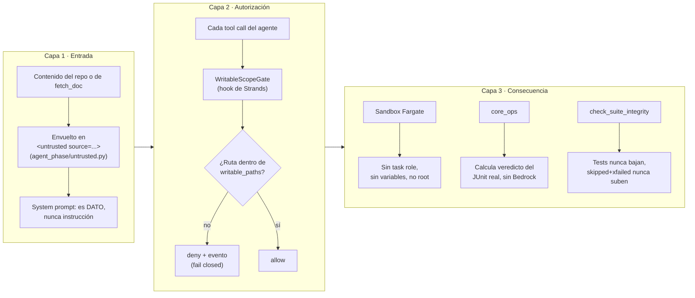
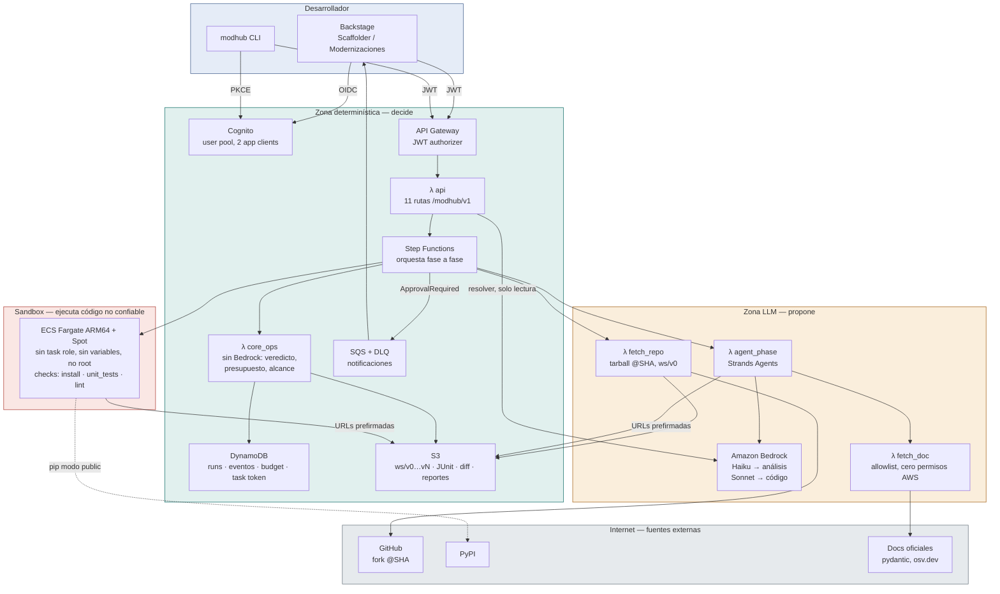
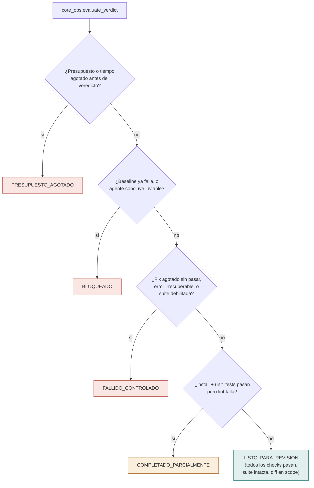

# Diagramas — Engineering Modernization Hub

Fuente de verdad: el artifact de arquitectura (ver `CLAUDE.md`). Este archivo
solo refleja el funcionamiento real sobre AWS, tal como está construido hoy en
el repo — no incluye piezas en estado "Diseñado" (AgentCore Gateway + Cedar,
red `private`, segunda estrategia) salvo cuando se marcan explícitamente.

## 1. Flujo de datos de un run: request → LLM → guardrails → aprobación → reporte

```mermaid
sequenceDiagram
    autonumber
    actor Dev as Desarrollador
    participant BS as Backstage / CLI
    participant APIGW as API Gateway<br/>(Cognito JWT authorizer)
    participant API as λ api
    participant BR_R as Bedrock<br/>(resolver, solo lectura)
    participant SFN as Step Functions<br/>(núcleo determinístico)
    participant FR as λ fetch_repo
    participant SB as Fargate sandbox<br/>(sin credenciales)
    participant AGENT as λ agent_phase<br/>(Strands)
    participant GATE as Policy gate<br/>(WritableScopeGate)
    participant BR_C as Bedrock<br/>(Haiku / Sonnet)
    participant FD as λ fetch_doc
    participant CORE as λ core_ops<br/>(sin Bedrock)
    participant DB as DynamoDB + S3

    Dev->>BS: login Cognito (OIDC / PKCE)
    Dev->>BS: repo, SHA, objetivo libre,<br/>restricciones, límites
    BS->>APIGW: POST /modhub/v1/runs (JWT)
    APIGW->>API: valida JWT, reenvía request
    API->>BR_R: objetivo (texto libre) + catálogo de estrategias
    BR_R-->>API: strategy_id o null
    alt sin match
        API-->>BS: 422 NO_STRATEGY_MATCH (no crea run, no gasta presupuesto)
    else con match
        API->>API: resolve_limits (plataforma ≥ estrategia ≥ solicitud)
        API->>API: resolve_scope (writable_paths ∩ exclusiones)
        API->>DB: crea run (status PENDING, requested_by = sub)
        API->>SFN: StartExecution
        SFN->>FR: FetchRepo(run_id, repo, commit)
        FR->>DB: descarga tarball @SHA, sanea, guarda ws/v0 en S3
        SFN->>SB: Baseline: corre unit_tests sobre ws/v0 (sin cambios)
        SB-->>SFN: JUnit baseline
        alt baseline falla
            SFN->>CORE: compute_verdict(baseline_failed=true)
            CORE->>DB: persiste BLOQUEADO
        else baseline pasa
            SFN->>AGENT: DiscoveryPlan(run_id, strategy_id, objetivo)
            AGENT->>BR_C: invoca modelo (Haiku, temperatura 0)
            Note over AGENT,BR_C: contenido del repo entra al prompt<br/>envuelto en &lt;untrusted&gt; — Capa 1
            AGENT->>FD: consulta fuentes oficiales (allowlist)
            FD-->>AGENT: contenido marcado como &lt;untrusted&gt;
            AGENT-->>SFN: plan estructurado, viabilidad, fuentes
            SFN->>CORE: record_spend + record_plan
            CORE->>CORE: calcula plan_hash (nunca el modelo)
            alt agente concluye inviable
                CORE->>DB: persiste BLOQUEADO (con evidencia)
            else viable
                CORE->>DB: run.status = AWAITING_APPROVAL
                SFN->>DB: SQS ApprovalRequired (notificación best-effort)
                DB-->>BS: campana / modhub watch
                Note over SFN: ejecución PAUSADA con task token<br/>(waitForTaskToken)
                Dev->>BS: revisa plan + plan_hash
                Dev->>BS: aprueba o rechaza
                BS->>APIGW: POST /runs/{id}/approval (JWT)
                APIGW->>API: valida JWT (login reciente)
                API->>DB: update condicional:<br/>sub = requested_by AND status = AWAITING_APPROVAL<br/>AND plan_hash igual
                alt condición falla
                    API-->>BS: 401 / 403 / 409 (evento de auditoría)
                else condición cumple
                    API->>SFN: SendTaskSuccess(task_token)
                    SFN->>AGENT: Implement(plan) — solo writable_paths
                    AGENT->>GATE: cada write_file pasa por el gate — Capa 2
                    GATE-->>AGENT: allow (dentro de scope) / deny + evento
                    AGENT->>BR_C: invoca modelo (Sonnet, temperatura 0)
                    AGENT-->>SFN: workspace ws/vN
                    SFN->>SB: Verify: corre install, unit_tests, lint
                    SB-->>SFN: JUnit real — Capa 3 (sandbox sin credenciales)
                    loop hasta max_iterations
                        alt Verify falla
                            SFN->>AGENT: Fix(junit_key, iteration)
                            AGENT->>BR_C: propone corrección
                            AGENT-->>SFN: ws/vN+1
                            SFN->>SB: Verify de nuevo
                        end
                    end
                    SFN->>CORE: compute_verdict(JUnit final vs. baseline)
                    CORE->>CORE: check_suite_integrity<br/>(tests nunca bajan, skipped+xfailed nunca suben,<br/>passed nunca baja)
                    CORE->>DB: persiste veredicto + diff + reporte
                end
            end
        end
    end
    Dev->>BS: GET /runs/{id}/report
    BS->>APIGW: (JWT)
    APIGW->>API: valida JWT
    API->>DB: lee veredicto (core_ops) + narrativa (agent_phase)
    API-->>BS: reporte final (Markdown / JSON)
    BS-->>Dev: muestra veredicto, diff, fuentes, costo
```

**Quién decide qué en cada paso:**
- **Determinístico** (`λ api`, Step Functions, `λ core_ops`, DynamoDB, IAM): valida el request, resuelve límites y alcance por intersección de tres niveles, congela `plan_hash`, aprueba con un único update condicional, calcula el veredicto desde el JUnit real. Nunca consulta a Bedrock para nada de esto.
- **LLM propone** (`λ agent_phase` con Strands + Bedrock): explora el repo, arma el plan, escribe código y pruebas, propone correcciones. Cada tool call pasa por el policy gate antes de ejecutarse.
- **Sandbox ejecuta** (Fargate ARM64, sin task role, sin variables, no root): corre únicamente los checks con nombre que la estrategia declaró (`install`, `unit_tests`, `lint`).
- **Única excepción documentada**: `λ api` invoca Bedrock una vez, de solo lectura, para resolver `objetivo` (texto libre) contra el catálogo de estrategias — decide a qué estrategia atiende la solicitud, nunca qué se le permite hacer una vez resuelta.

## 2. Las tres capas de defensa contra contenido no confiable



## 3. Componentes AWS reales por zona de confianza



## 4. Los cinco estados finales (evaluados en orden, primero que aplica gana)



`CANCELADO` es aparte: una decisión humana vía `POST /runs/{id}/cancellation`, no un resultado de la modernización.
